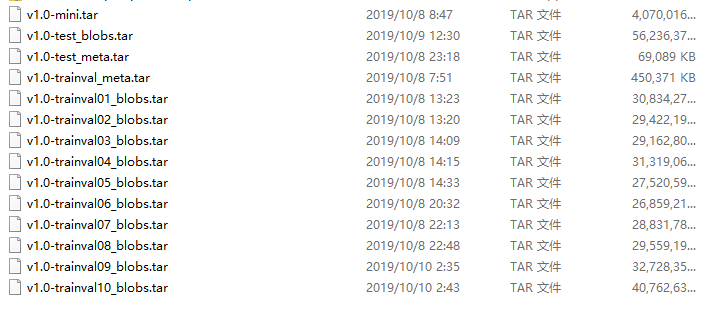
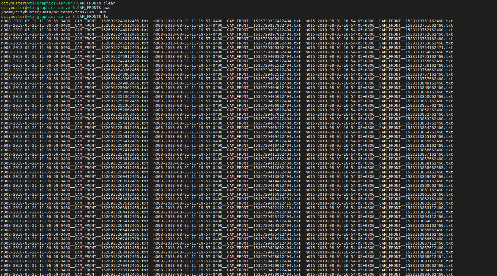
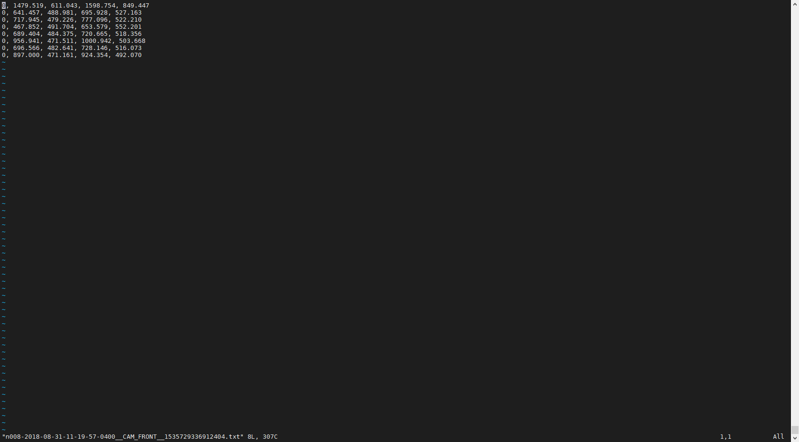

# SAF-FCOS: Spatial Attention Fusion for Obstacle Detection using MmWave Radar and Vision Sensor

This project hosts the code for implementing the SAF-FCOS algorithm for object detection, as presented in our paper:

    SAF-FCOS: Spatial Attention Fusion for Obstacle Detection using MmWave Radar and Vision Sensor;
    Shuo Chang, YiFan Zhang, Fan Zhang, Xiaotong Zhao, Sai Huang, ZhiYong Feng and Zhiqing Wei;
    In: Sensors, 2019.

And the whole project is built upon FCOS, Below is FCOS license.

```
FCOS for non-commercial purposes

Copyright (c) 2019 the authors
All rights reserved.

Redistribution and use in source and binary forms, with or without
modification, are permitted provided that the following conditions are met:

* Redistributions of source code must retain the above copyright notice, this
  list of conditions and the following disclaimer.

* Redistributions in binary form must reproduce the above copyright notice,
  this list of conditions and the following disclaimer in the documentation
  and/or other materials provided with the distribution.

THIS SOFTWARE IS PROVIDED BY THE COPYRIGHT HOLDERS AND CONTRIBUTORS "AS IS"
AND ANY EXPRESS OR IMPLIED WARRANTIES, INCLUDING, BUT NOT LIMITED TO, THE
IMPLIED WARRANTIES OF MERCHANTABILITY AND FITNESS FOR A PARTICULAR PURPOSE ARE
DISCLAIMED. IN NO EVENT SHALL THE COPYRIGHT HOLDER OR CONTRIBUTORS BE LIABLE
FOR ANY DIRECT, INDIRECT, INCIDENTAL, SPECIAL, EXEMPLARY, OR CONSEQUENTIAL
DAMAGES (INCLUDING, BUT NOT LIMITED TO, PROCUREMENT OF SUBSTITUTE GOODS OR
SERVICES; LOSS OF USE, DATA, OR PROFITS; OR BUSINESS INTERRUPTION) HOWEVER
CAUSED AND ON ANY THEORY OF LIABILITY, WHETHER IN CONTRACT, STRICT LIABILITY,
OR TORT (INCLUDING NEGLIGENCE OR OTHERWISE) ARISING IN ANY WAY OUT OF THE USE
OF THIS SOFTWARE, EVEN IF ADVISED OF THE POSSIBILITY OF SUCH DAMAGE.

```

The full paper is available at: [https://www.mdpi.com/1424-8220/20/4/956](https://www.mdpi.com/1424-8220/20/4/956).

## You should known

Please read the FCOS project first [FCOS-README.md](FCOS-README.md)

## Installation

Please check [INSTALL.md](INSTALL.md) for installation instructions.

## Generate Data

1. Please download Full dataset (v1.0) of nuScenes dataset from the [link](https://www.nuscenes.org/download).
   

2. Then, upload all download tar files to an ubuntu server, and uncompress all *.tar files in a specific folder:

```shell
mkdir ~/Data/nuScenes
mv AllDownloadTarFiles ~/Data/nuScenes
cd ~/Data/nuScenes
for f in *.tar; do tar -xvf "$f"; done
```

3. Convert the radar pcd file as image:

```shell
python tools/nuscenes/convert_radar_point.py --dataroot ~/Data/nuScenes
```

4. Calculate the norm info of radar images:

```shell
python tools/nuscenes/extract_pc_image_norm_info_from_image.py --datadir ~/Data/nuScenes --outdir ~/Data/nuScenes/v1.0-trainval
```

5. Generate 2D detections results for nuScenes CAM_FRONT images by 'FCOS_imprv_dcnv2_X_101_64x4d_FPN_2x.pth',   
   some of detection results should be refined by labelers to get tighter bboxes,   
   and save the detection results as txt file in the folder ~/Data/nuScenes/fcos/CAM_FRONT:  
   
   
   The detection results are saved as '0, 1479.519, 611.043, 1598.754, 849.447'. The first column is category, and the
   last stands for position.  
   For convenience, we supply our generated 2D txt files in cloud drive and in folder data/fcos.zip.  
   For users not in China, please download
   from [google drive](https://drive.google.com/file/d/12SXDFUWpTPUKaWTn8yuoG-_CHaXVVGB7/view?usp=sharing).  
   For users in China, please download from [baidu drive](https://pan.baidu.com/s/11NNYpmBbs5sSqSsFxl-z7Q).
   ```shell
   链接：https://pan.baidu.com/s/11NNYpmBbs5sSqSsFxl-z7Q 
   提取码：6f1x 
   ```

   If you use our generated txt files, please:

```shell
mv fcos.zip ~/Data/nuScenes
unzip fcos.zip
```

6. Generate 2D annotations in coco style for model training and test:

```shell
python tools/nuscenes/generate_2d_annotations_by_fcos.py --datadir ~/Data/nuScenes --outdir ~/Data/nuScenes/v1.0-trainval
```

## Prepare training

The following command line will train fcos_imprv_R_101_FPN_1x_ATTMIX_135_Circle_07.yaml on 8 GPUs with Synchronous
Stochastic Gradient Descent (SGD):

```shell
python -m torch.distributed.launch \
       --nproc_per_node=8 \
       --master_port=$((RANDOM + 10000)) \
       tools/train_net.py \
       --config-file configs/fcos_nuscenes/fcos_imprv_R_101_FPN_1x_ATTMIX_135_Circle_07.yaml \
       DATALOADER.NUM_WORKERS 2 \
       OUTPUT_DIR tmp/fcos_imprv_R_50_FPN_1x
```

## Prepare Test

The following command line will test fcos_imprv_R_101_FPN_1x_ATTMIX_135_Circle_07.yaml on 8 GPUs:

```shell

python -m torch.distributed.launch \
       --nproc_per_node=8  
       --master_port=$((RANDOM + 10000)) \
       tools/test_epoch.py \
       --config-file configs/fcos_nuscenes/fcos_imprv_R_101_FPN_1x_ATTMIX_135_Circle_07.yaml \
       --checkpoint-file tmp/fcos_imprv_R_50_FPN_1x_ATTMIX_135_Circle_07/model_0010000.pth \ 
       OUTPUT_DIR tmp/fcos_imprv_R_101_FPN_1x_ATTMIX_135_Circle_07
```

## Citations

Please consider citing our paper and FOCS in your publications if the project helps your research. BibTeX reference is
as follows.

```
@article{chang2020spatial,
  title={Spatial Attention fusion for obstacle detection using mmwave radar and vision sensor},
  author={Chang, Shuo and Zhang, Yifan and Zhang, Fan and Zhao, Xiaotong and Huang, Sai and Feng, Zhiyong and Wei, Zhiqing},
  journal={Sensors},
  volume={20},
  number={4},
  pages={956},
  year={2020},
  publisher={Multidisciplinary Digital Publishing Institute}
}
@inproceedings{tian2019fcos,
  title   =  {{FCOS}: Fully Convolutional One-Stage Object Detection},
  author  =  {Tian, Zhi and Shen, Chunhua and Chen, Hao and He, Tong},
  booktitle =  {Proc. Int. Conf. Computer Vision (ICCV)},
  year    =  {2019}
}
```